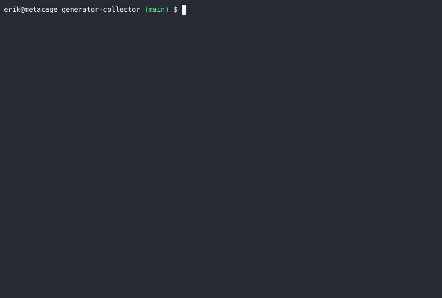

# generator-collector
> :recycle: Lazily collect and query generators in JS
---

> :warning: This project is **experimental** and should not be considered stable for production use.

## Features

- Collect and query generator results using coroutines
- Iterate only to the values you need, only when you need them
- Seamless integration with promises and async functions

## Resources

- :book: [Documentation](https://slurmulon.github.io/generator-collector)
- :anchor: [Install](https://slurmulon.github.io/generator-collector/#/install)
- :wrench: [API](https://slurmulon.github.io/generator-collector/#/api/)
- :bulb: [Usage and Examples](https://slurmulon.github.io/generator-collector/#/usage)

## Example

The following example is the output of a [blackjack engine](https://github.com/slurmulon/generator-collector/blob/main/examples/blackjack/index.mjs) written using `generator-collector`.

It implements a state machine based on asynchronous coroutines, allowing it to run many blackjack games lazily, cooperatively and concurrently!

- Emoji players (:skull:) are in one game, `P` players are in another and 💸 is the dealer in both.
- The result of each game is logged with the `[play:round]` prefix.
- Random timeouts are added between player turns to give the effect of real gameplay.

## Contact & Support

-  Create a [GitHub issue](https://github.com/slurmulon/generator-collector/issues) for bug reports, feature requests, or questions
-   Add a ⭐️ [star on GitHub](https://github.com/slurmulon/generator-collector) or ❤️ [tweet](https://twitter.com/intent/tweet?url=https%3A%2F%2Fgithub.com%2Fslurmulon%2Fgenerator-collector&hashtags=js,generators,promises,queries) to support the project!

## License

Copyright © Erik Vavro. All rights reserved.

Licensed under the [MIT License](https://opensource.org/licenses/MIT).
